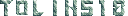
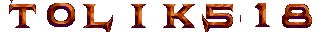

<div align="center">  

# 
[](https://crates.io/crates/bitmap_type_tracer)
[](https://crates.io/crates/bitmap_type_tracer)
[](https://github.com/tolik518/bitmap_type_tracer/issues)
[](https://github.com/tolik518/bitmap_type_tracer/pulls)

`bitmap_type_tracer` is a utility tool, written in Rust, for generating text-images using a provided bitmap-font (and a set of configuration parameters).

</div>

## Features
- Generate images from a font bitmap using a custom sequence and text.
- Load and save font configurations for reuse.
- Customize margins and threshold for more precise image generation.

## Getting Started

### Font Source
The fonts used in this project are sourced from [ianhan/BitmapFonts](https://github.com/ianhan/BitmapFonts/tree/main) repository.


### Installation
Make sure you have [Rust](https://www.rust-lang.org/tools/install) installed on your system.  
Then, run the following command to install the tool from [crates.io](https://crates.io/crates/bitmap_type_tracer):
```bash 
cargo install bitmap_type_tracer --locked
```


### How to Run

#### Specifying Arguments Directly:

```bash
bitmap_type_tracer <path_to_font_image> <sequence> <text> <chars_per_row> [--top VALUE] [--bottom VALUE] [--left VALUE] [--right VALUE] [--threshold VALUE] [--save-json]
```

example:
```bash
bitmap_type_tracer "examples/4138906397_0dc616813b_o.png" " !\"    '()*+,-.\\0123456789:; = ? ABCDEFGHIJKLMNOPQRSTUVWXYZ " "Bitmap Type Tracer" 10 --threshold 1 --save-json
```

#### Using Font Configuration:
For this method, you will need to have a font configuration file saved. You can do this by running the command with the `--save-json` flag when you specified all the arguments.
```bash
bitmap_type_tracer <path_to_font_image> <text>
```

example:
```bash
bitmap_type_tracer "examples/4138906397_0dc616813b_o.png" "Bitmap Type Trace"
```

This command will generate an image using a previously saved font configuration for the provided font image and the specified text.


**Arguments:**

- `<path_to_font_image>`: Path to the font image (bitmap) you want to use.

- `<sequence>`: A sequence of characters as they appear in the font bitmap.

- `<text>`: The text you want to generate as an image.

- `<chars_per_row>`: Number of characters in a row in the font bitmap.

**Optional Flags:**

- `--top VALUE`: Specify top margin. Default is 0.

- `--bottom VALUE`: Specify bottom margin. Default is 0.

- `--left VALUE`: Specify left margin. Default is 0.

- `--right VALUE`: Specify right margin. Default is 0.

- `--threshold VALUE`: Specify the threshold for color comparisons. Default is 0.

- `--save-json`: Save the provided configuration as a JSON file, making it easier to reuse in the future.

- `--lang en|it|fr|en`: Specify the language of the text. Default is your System language if supported, otherwise its set to en.

## Modules

- `main.rs`: The main driver of the application, handling command line arguments and invoking image generation.

- `font_config.rs`: Handles the loading and saving of font configurations.

- `image_processing.rs`: Contains the core image processing functions. (This module was mentioned but its content was not provided in the given code.)

## Examples

_/examples/4138906397_0dc616813b_o.png_  
  
```bash
bitmap_type_tracer examples/4138906397_0dc616813b_o.png " \!\"    '()*+,-.\\0123456789:; = ? ABCDEFGHIJKLMNOPQRSTUVWXYZ " tolik518 10
```
  

---------------------------------------

_/examples/4138906425_29cbc92641_o.png_  
  
```bash
bitmap_type_tracer examples/4138906425_29cbc92641_o.png " \!\"    '()*+,-.\\0123456789:; = ? ABCDEFGHIJKLMNOPQRSTUVWXYZ " tolik518 10
```
  

---------------------------------------
  
_/examples/FONT34.png_    
  
```bash
bitmap_type_tracer examples/FONT34.png " \!      ()  , . 0123456789:; - ? ABCDEFGHIJKLMNOPQRSTUVWXYZ " tolik518 20 --bottom 150 --threshold 20
```
  

---------------------------------------
  
_/examples/font228.png_   
  
```bash
bitmap_type_tracer examples/font228.png "ABCDEFGHIJKLMNOPQRSTUVWXYZ>.: " tolik518 10 --threshold 0
```  
Since the number are missing from the sequence, they are not generated in the image and it tries to fill the space with the background.   
The background was not recognized properly, so it was filled with the brown instead of black.  
  

---------------------------------------
  
_/examples/font239r.png_  
  
```bash  
bitmap_type_tracer examples/font239r.png "ABCDEFGHIJKLMNOPQRSTUVWXYZ()\!?.,’  " tolik518 7 --bottom 4 --threshold 1
```
Since the number are missing from the sequence, they are not generated in the image and it tries to fill the space with the background, but the threshold is set to 1, so it doesn't fill the space with the transparent background since it recognized the black background.  
  

---------------------------------------

_/examples/font244r.png_   
   
```bash  
bitmap_type_tracer examples/font244r.png "ALW6BMX7CNY8DOZ9EP*\!FQ0?GR1.HS2 IT3 JU4 KV5 " tolik518 4 --threshold 30 
```  
We needed a threshold of 30 to remove the black background.   
  

---------------------------------------

_/examples/font248r.png_  
  
```bash
bitmap_type_tracer examples/font248r.png "ABCDEFGHIJKLMNOPQRSTUVWXYZ0123456789 \!?." tolik518 20 --threshold 60
```
To have a better result, we needed a threshold of 60 to remove the black background.  
  

---------------------------------------

_/examples/MEGAD.png_  
  
```bash
bitmap_type_tracer examples/MEGAD.png "'() +,-. 0123456789:ABCDEFGHIJKLMNOPQRSTUVWXYZ     ! =?     " tolik518 10 --bottom 10 --threshold 1
```  
In this example, we needed to add a bottom margin of 10 for the characters to align properly.  
  

---------------------------------------

_/examples/MEGAD2.png_  
  
```bash
bitmap_type_tracer examples/MEGAD2.png "AGMSY+:4BHNTZ\!;5CIOU.?06DJPV;(17EKQW\")28FLRX-'39" tolik518 8 --bottom 3 --threshold 1
```  
  


## Contributions

Feel free to contribute by opening issues or pull requests. All feedback is welcome!

<div align="center">  


</div>
